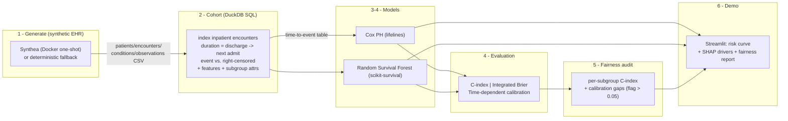

# ReadmitRisk

> Survival analysis of time-to-hospital-readmission with calibrated risk estimates and a fairness audit — on fully synthetic EHR data. `docker compose up` and explore a patient's risk curve in minutes.

> **Note:** this README is finalized in Phase 6. The architecture diagram and run
> instructions below are stable; evaluation/fairness results are filled in as the
> pipeline is built.

## Why survival analysis (not a binary classifier)

Hospital 30-day readmission is a **time-to-event** problem with **right-censoring**:
many patients simply haven't been readmitted *yet* by the end of follow-up, and a naïve
binary "readmitted: yes/no" classifier throws that information away (or mislabels it).
ReadmitRisk models the full survival distribution, evaluates with survival metrics
(Harrell's C-index, integrated Brier score, time-dependent calibration), and audits
fairness across demographic subgroups.

## Architecture



## Data: synthetic, MIMIC-IV-ready

Data is generated **synthetically** — no PHI, no credentialing, no cloud. The primary
backend is [Synthea](https://github.com/synthetichealth/synthea) (Apache 2.0) run as a
Docker one-shot. A deterministic, **Synthea-schema-compatible** Python fallback
generator produces identical CSV columns so the pipeline runs without Java (used for CI
and the committed sample). The cohort SQL is written against the Synthea CSV schema and
is **MIMIC-IV-ready** in architecture (swap the source tables, keep the survival
methodology) — see *Future work*.

## Quick start

```bash
docker compose up        # generate data + run pipeline + launch the Streamlit demo
# or locally with uv:
make install
make pipeline            # generate -> cohort -> train -> eval -> fairness
make demo                # Streamlit risk-curve app
```

Individual stages: `make generate`, `make cohort`, `make train`, `make eval`,
`make fairness`. See `make help`.
