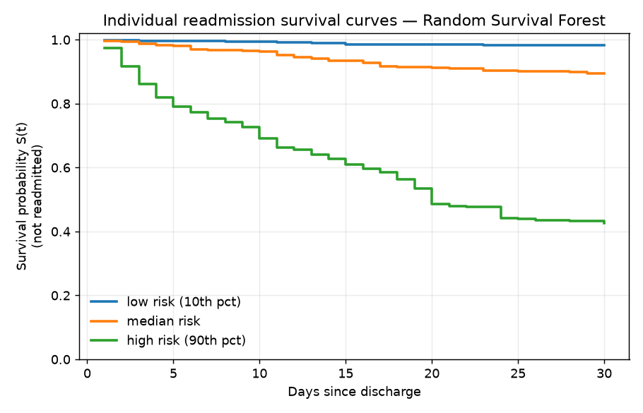
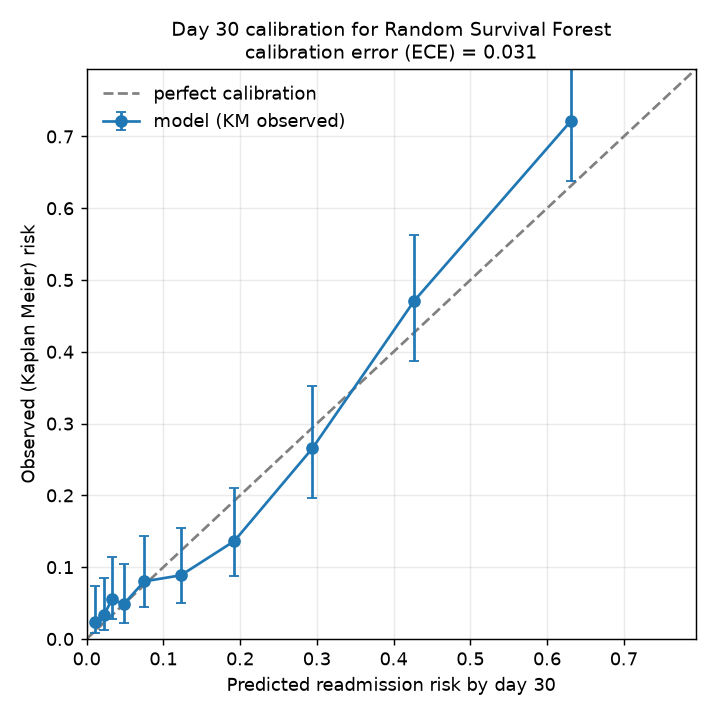
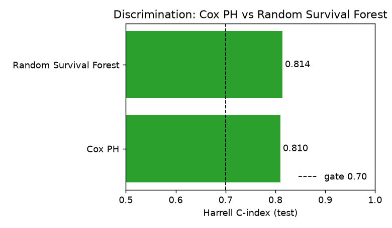
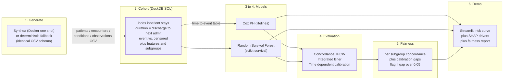
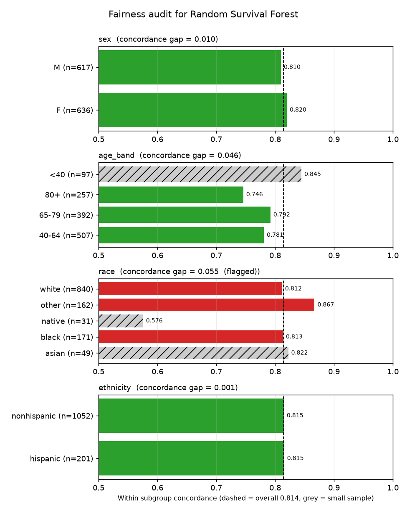

# ReadmitRisk 🏥

**I built a system that predicts when a hospital patient is likely to be readmitted, using survival analysis instead of a plain yes or no classifier. It handles censoring correctly, calibrates its risk over time, audits itself for fairness across demographic groups, and ships with an interactive demo. The data is fully synthetic and everything runs locally with one command.**

> Author: **Linga Reddy Gudisha**

```bash
git clone https://github.com/lithin45/readmitrisk && cd readmitrisk
docker compose up          # generates synthetic EHR, runs the pipeline, serves the demo
```

No API keys. No cloud services. No language models. No dataset paperwork. The build generates its own data.

---

## Why I built this

Hospitals in the US are financially penalized for too many 30 day readmissions (the CMS Hospital Readmissions Reduction Program). Care teams want to know not just *whether* a patient will come back, but *when* the risk is highest, so they can target follow up. That is a "time to event" question, and it comes with a statistical trap that most readmission portfolios get wrong:

> Many patients simply have not been readmitted *yet* when follow up ends. They are **censored**, not negatives. A plain "readmitted: yes or no" classifier either throws that information away or quietly mislabels it, and then "accuracy" stops meaning anything.

So I did it the proper way. I model the full survival curve, score it with survival metrics only (Harrell's and IPCW concordance, integrated Brier score, time dependent calibration), and audit fairness across subgroups. The censoring rule is enforced as a tested invariant: there is a unit test that rejects classification accuracy outright.

**Who would use it:** hospital quality and population health teams, care management programs, and engineers who need a defensible, calibrated, auditable readmission risk model rather than a black box score.

---

## Headline results

Honest numbers on a held out test split, grouped by patient so no one appears in both train and test. Reproduce with `make eval`:

| Model | Concordance (C index) | IPCW concordance | Integrated Brier ↓ | mean time AUC | Calibration error |
|---|---|---|---|---|---|
| **Random Survival Forest** | **0.814** | 0.817 | **0.083** | 0.839 | **0.030** |
| Cox Proportional Hazards | 0.810 | 0.812 | 0.089 | 0.834 | 0.046 |

*Integrated Brier of 0.25 means uninformative; lower is better. The gate requires concordance of at least 0.70, and it passes.*

<p align="center">
  
  
</p>
<p align="center">
  
</p>

---

## How it fits together



Module layout under `src/readmitrisk/`: `generate/`, `cohort/`, `models/`, `evaluation/`, `fairness/`, `explain/`, `ui/`.

---

## Data: synthetic, ethical, MIMIC ready

The data is fully synthetic, so there is no PHI, no IRB, no credentialing, and no cloud.

- **Primary generator: [Synthea](https://github.com/synthetichealth/synthea)** (SyntheticHealth, Apache 2.0), run as a Docker one shot with a fixed seed (`make up-synthea`, or the `synthea` compose profile). It produces a realistic synthetic population (patients, encounters, conditions, observations) as CSV.
- **A deterministic fallback generator** (`generate/fallback.py`) writes the exact same Synthea CSV schema, so the whole downstream pipeline, especially the DuckDB cohort SQL, is one single code path no matter which backend produced the files. It powers CI, the committed sample, and a zero setup first run. The readmission signal is encoded only through a realistic hospitalization process (a risk driven readmission probability and timing), never by writing labels directly, so the SQL re derives durations and events from raw timestamps exactly as it would for real Synthea.

> **MIMIC ready (a stretch goal).** I deliberately replaced MIMIC-IV, which needs one to two weeks of credentialing, so the project is self contained and reproducible. The architecture is MIMIC ready: the survival methodology, evaluation, and fairness audit are dataset agnostic. Point the cohort SQL at MIMIC's admissions, patients, and diagnoses tables (same index encounter and next admission logic) and the rest is unchanged.

> **Ethics note.** Synthetic patients are not real people, and nothing here is a medical device or a clinical tool. A readmission risk model can encode and amplify disparities in care, which is exactly why the fairness audit is a first class, gating part of the pipeline rather than an afterthought. Any real deployment would need prospective validation, calibration drift monitoring, clinician oversight, and governance.

---

## Cohort construction: the DuckDB clinical SQL ⭐

The heart of the data work is **[`sql/cohort.sql`](sql/cohort.sql)**, heavily commented clinical SQL that DuckDB runs directly over the raw CSVs with no load step. From raw records it builds tidy time to event rows:

- **Index selection.** Every completed inpatient stay is a candidate index. Stays during which the patient died are excluded, since they cannot be readmitted.
- **The readmission clock.** Duration is the time from discharge to the next inpatient admission, computed with a windowed `LEAD`.
- **Censoring, three ways**, using `LEAST(horizon, days to death, days to end of data)`:
  - administrative (no readmission inside the 30 day window, so censored at 30),
  - death before readmission (censored at death),
  - end of data truncation (discharged too close to "now").
- **Features.** Age, length of stay, comorbidity count plus a Charlson style weighted score (a `VALUES` weight map), prior utilization (a lookback range join over prior encounters, inpatient, and ED), and the latest labs (BMI, systolic BP, HbA1c, glucose) pulled with `ASOF` joins (most recent value at or before discharge, inside a lookback window).
- **Subgroup attributes** (sex, age band, race, ethnicity) are carried for the fairness audit only, and never used as model inputs.

A golden test ([`tests/test_cohort_golden.py`](tests/test_cohort_golden.py)) pins the exact event, censor, death, and beyond window logic on a hand built dataset.

---

## Why survival analysis and not a classifier

| Binary classifier | Survival model (what I built) |
|---|---|
| "Readmitted in 30 days?" yes or no | Models S(t), the chance of staying out of hospital through each day t |
| Censored patients mislabeled as negatives | Censoring handled in the likelihood (Cox partial likelihood, log rank splits) |
| Scored with accuracy or ROC AUC | Scored with concordance, integrated Brier, and time dependent calibration |
| One number | A risk curve that shows *when* risk accrues |

I fit and compare two complementary models:

- **Cox Proportional Hazards** (lifelines): interpretable hazard ratios and exact SHAP.
- **Random Survival Forest** (scikit-survival): non linear, captures interactions, and the stronger discriminator here.

---

## Evaluation: survival metrics only, with a hard gate

`make eval` prints the metrics table and exits with a failure code if the concordance gate is missed or if the survival metric rule is broken. Specifically:

- **Discrimination:** Harrell's concordance plus Uno's IPCW concordance (which corrects for the censoring distribution).
- **Overall fit:** the integrated Brier score over the window (IPCW weighted, with truncation handling for the mass of administrative censoring at day 30).
- **Calibration:** a time dependent reliability curve at day 30, predicted risk versus Kaplan Meier observed risk per decile (KM is censoring aware, so you cannot just count events).
- **The censoring invariant:** [`tests/test_metrics_censoring.py`](tests/test_metrics_censoring.py) proves my concordance matches an independent censoring aware brute force, and that a naive "treat censored as negative" accuracy gives a different, wrong answer. Classification accuracy is rejected by `assert_survival_metrics`.

---

## Fairness audit

`make fairness` computes the within subgroup concordance and calibration error for sex, age band, race, and ethnicity, reports the gap (best minus worst over reliable subgroups), and flags any gap over 0.05.

<p align="center"></p>

One statistically honest detail: subgroup concordance has a standard error of roughly 0.5 over the square root of the number of events, so subgroups with fewer than 10 events or fewer than 50 rows are reported for transparency but excluded from gap flagging (a caveat, not a pass). On the full synthetic run this surfaces a modest `race` flag (gap around 0.055) while `sex`, `age_band`, and `ethnicity` stay within tolerance, and even the reliable subgroup numbers carry wide confidence intervals on a single split.

---

## The interactive demo

`make demo` (or `docker compose up`) launches a Streamlit app:

- **Patient risk:** pick a synthetic index hospitalization and see its survival curve (Cox vs RSF), its 30 day risk, the true outcome, and the SHAP drivers showing which features push this patient's risk up or down.
- **Model evaluation:** the metrics table plus the discrimination, survival, and calibration plots.
- **Fairness audit:** the per subgroup table with flags and caveats.

The app is a safe, self contained demo on synthetic data, with no external services or keys, so it is free to run and free to host.

---

## How to run

```bash
# One command: generate data, run the pipeline, serve the demo at http://localhost:8501
docker compose up
docker compose --profile synthea up        # use the real Synthea generator instead

# Or locally with uv (Python 3.11):
make install        # uv sync, including dev tools
make pipeline       # generate, cohort, train, eval, fairness
make demo           # Streamlit risk curve app
make test           # pytest, including the censoring invariant
make eval           # the gate: prints metrics, fails if concordance is under 0.70
make fairness       # the subgroup audit
```

Individual stages and `make help` are in the [Makefile](Makefile). Config lives in [`config/`](config/) and can be overridden with environment variables (see [`.env.example`](.env.example)).

**Reproducibility:** pinned dependencies (`uv.lock`), a fixed generator seed, versioned cohort SQL, and a small committed sample (`data/sample/cohort.parquet`) that CI and the `--sample` targets run against. CI ([`.github/workflows/ci.yml`](.github/workflows/ci.yml)) runs ruff, pytest, and the eval gate on that sample.

**Deploy the demo (optional):** point Streamlit Community Cloud at `streamlit_app.py`; it installs `requirements.txt` and runs the app on the committed sample. Nothing else is needed.

---

## Limitations and future work

- **Synthetic data has a cleaner signal than real records.** Because the generator encodes a controlled risk process, the concordance here (around 0.81) is higher than what is realistically achievable on real readmission data (around 0.65 to 0.78). The point of this project is the methodology (censoring, calibration, fairness, reproducibility), which is what carries over. The absolute discrimination does not, and I say so plainly rather than dressing it up.
- **Some race and ethnicity strata are small,** so their subgroup numbers are noisy, which is why the low confidence caveats and the event count guard exist.
- **Cox assumes proportional hazards.** I include the Random Survival Forest precisely because it does not.
- **Future work:** wire the cohort SQL to MIMIC-IV, treat death as a competing risk rather than censoring, add time varying covariates, recalibrate over time, and add gradient boosted survival baselines.

---

## Tech stack

Python 3.11, uv, DuckDB, lifelines, scikit-survival, scikit-learn, SHAP, subgroup fairness analysis, matplotlib and Plotly, Streamlit, pytest, ruff, Docker Compose, and GitHub Actions. License: Apache 2.0 (matching Synthea).
