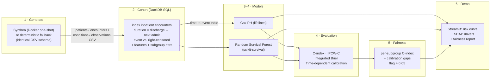

# ReadmitRisk 🏥

**Time-to-hospital-readmission modeled as survival analysis — with right-censoring handled correctly, calibrated risk over time, a responsible-ML fairness audit, and an interactive risk-curve demo. Fully synthetic data, fully local, one command to run.**

```bash
git clone … && cd readmit_risk_project_6
docker compose up          # generates synthetic EHR → runs the pipeline → serves the demo
```

No API keys. No cloud. No LLM. No dataset credentialing. The data is generated by the build itself.

---

## Why this exists

Hospitals in the U.S. are financially penalized for excess 30-day readmissions (CMS Hospital Readmissions Reduction Program). Care teams want to know **not just *whether* a patient will be readmitted, but *when* the risk is highest**, so they can target follow-up. That is a **time-to-event** question, and it comes with a statistical catch that most "readmission predictor" portfolios get wrong:

> Many patients simply **haven't been readmitted *yet*** at the end of follow-up. They are **right-censored**, not negatives. A binary "readmitted: yes/no" classifier either throws that information away or silently mislabels it — and then "accuracy" becomes meaningless.

ReadmitRisk does it the right way: it models the full survival distribution, evaluates with **survival metrics only** (Harrell's & IPCW C-index, integrated Brier score, time-dependent calibration), and audits **fairness across demographic subgroups**. The censoring-correctness rule is enforced as a *tested invariant* — there is a unit test that rejects classification accuracy outright.

**Who'd use it:** hospital quality / population-health teams, care-management programs, and ML engineers who need a defensible, calibrated, auditable readmission risk model rather than a black-box score.

---

## Headline results

Honest numbers on a held-out, **group-aware** test split (no patient appears in both train and test). Run `make eval`:

| Model | Harrell C-index | IPCW C-index | Integrated Brier ↓ | mean time-AUC | Calibration error |
|---|---|---|---|---|---|
| **Random Survival Forest** | **0.814** | 0.817 | **0.083** | 0.839 | **0.030** |
| Cox Proportional Hazards | 0.810 | 0.812 | 0.089 | 0.834 | 0.046 |

*Integrated Brier 0.25 = uninformative; lower is better. Gate: C-index ≥ 0.70 → **PASS**.*

<p align="center">
  
  
</p>
<p align="center">
  
</p>

---

## Architecture



**Module layout** (`src/readmitrisk/`): `generate/` · `cohort/` · `models/` · `evaluation/` · `fairness/` · `explain/` · `ui/`.

---

## Data — synthetic, ethical, MIMIC-IV-ready

The data is **fully synthetic** — no PHI, no IRB, no credentialing, no cloud.

- **Primary generator: [Synthea](https://github.com/synthetichealth/synthea)** (SyntheticHealth, Apache-2.0), run as a **Docker one-shot** with a fixed seed (`make up-synthea` / the `synthea` compose profile). It emits a realistic synthetic patient population (patients, encounters, conditions, observations) as CSV.
- **Deterministic fallback generator** (`generate/fallback.py`) emits the **exact same Synthea CSV schema**, so the entire downstream pipeline — the DuckDB cohort SQL especially — is a *single code path* regardless of backend. It is what powers CI, the committed sample, and a zero-setup first run. The readmission signal is encoded purely through a realistic hospitalization *process* (risk-dependent readmission probability + timing), never by writing labels directly; the SQL re-derives durations and events from raw timestamps exactly as it would for real Synthea.

> **MIMIC-IV-ready (stretch).** This deliberately replaces MIMIC-IV, which needs 1–2 weeks of credentialing, so the project is self-contained and reproducible. The architecture is **MIMIC-IV-ready**: the survival methodology, evaluation, and fairness audit are dataset-agnostic — point the cohort SQL at MIMIC's `admissions`/`patients`/`diagnoses_icd` tables (same index-encounter / next-admission logic) and the rest is unchanged.

> **Ethics & compliance note.** Synthetic patients are not real people; nothing here is a medical device or clinical decision tool. A readmission risk model can encode and amplify disparities in care — which is exactly why the fairness audit is a first-class, gating part of the pipeline, not an afterthought. Any real deployment would require prospective validation, calibration drift monitoring, clinician oversight, and governance.

---

## Cohort construction — the DuckDB clinical SQL ⭐

The heart of the data work is **[`sql/cohort.sql`](sql/cohort.sql)** — heavily-commented clinical SQL run by DuckDB directly over the raw CSVs (no load step). From raw EHR it builds tidy **time-to-event records**:

- **Index selection** — every completed inpatient stay is a candidate index (stays during which the patient died are excluded — they can't be readmitted).
- **The readmission clock** — `duration = discharge → next inpatient admission` via a windowed `LEAD`.
- **Right-censoring, three ways**, via `LEAST(horizon, days-to-death, days-to-end-of-data)`:
  - administrative (no readmission within the 30-day horizon → censored at 30),
  - death before readmission (censored at death),
  - end-of-data truncation (discharged too close to "now").
- **Features** — age, length of stay, comorbidity **count + Charlson-style weighted score** (a `VALUES` weight map), prior utilization (lookback range join: prior encounters / inpatient / ED), and **latest labs** (BMI, systolic BP, HbA1c, glucose) pulled with **`ASOF` joins** (most-recent value at/before discharge, within a lookback window).
- **Subgroup attributes** (sex, age band, race, ethnicity) — carried for the fairness audit only, **never** as model inputs.

A **golden test** ([`tests/test_cohort_golden.py`](tests/test_cohort_golden.py)) pins the exact event/censor/death/beyond-window semantics on a hand-crafted dataset.

---

## Survival methodology — why not a binary classifier

| Binary classifier | Survival model (here) |
|---|---|
| "Readmitted in 30 days?" yes/no | Models S(t) = P(not readmitted by day *t*) for every *t* |
| Censored patients mislabeled as negatives | Censoring handled in the likelihood (Cox partial likelihood, log-rank splits) |
| Evaluated with accuracy / ROC-AUC | Evaluated with C-index, integrated Brier, **time-dependent** calibration |
| One number | A **risk curve** — *when* risk accrues, not just whether |

Two complementary models are fit and compared:

- **Cox Proportional Hazards** (lifelines) — interpretable hazard ratios, exact SHAP (linear).
- **Random Survival Forest** (scikit-survival) — non-linear, captures interactions; the stronger discriminator here.

---

## Evaluation — survival metrics only (a hard gate)

`make eval` prints the metrics table above and **exits non-zero** if the C-index gate is missed *or* if the survival-metric invariant is violated. Specifically:

- **Discrimination:** Harrell's C-index + Uno's IPCW C-index (corrects for the censoring distribution).
- **Overall fit:** Integrated Brier score over the horizon (IPCW-weighted; with administrative-truncation handling for the censoring point-mass at day 30).
- **Calibration:** a **time-dependent** reliability curve at day 30 — predicted risk vs. **Kaplan-Meier observed** risk per decile (KM is censoring-aware; you cannot just count events).
- **Censoring invariant:** [`tests/test_metrics_censoring.py`](tests/test_metrics_censoring.py) proves our concordance matches an independent censoring-aware brute force *and* that a naive "treat censored as negative" accuracy gives a different, wrong answer. Classification accuracy is rejected by `assert_survival_metrics`.

---

## Fairness audit

`make fairness` computes the **within-subgroup C-index and calibration error** for sex, age band, race, and ethnicity, reports the **gap** (best − worst over reliable subgroups), and **flags any gap > 0.05**.

<p align="center"></p>

A statistically honest detail: subgroup C-index has standard error ≈ 0.5/√(events), so subgroups with **< 10 events** or **n < 50** are reported for transparency but **excluded from gap flagging** (a caveat, not a pass). On the full synthetic run this surfaces a modest **`race` flag (gap ≈ 0.055)** while `sex`, `age_band`, and `ethnicity` are within tolerance — and even "reliable" subgroup metrics carry wide confidence intervals on a single split.

---

## The risk-curve demo

`make demo` (or `docker compose up`) launches a **Streamlit** app:

- **🧑‍⚕️ Patient risk** — pick a synthetic index hospitalization → its **survival curve** (Cox vs RSF), 30-day risk, ground-truth outcome, and **SHAP drivers** showing which features push *this* patient's risk up or down.
- **📊 Model evaluation** — the metrics table + discrimination / survival / calibration plots.
- **⚖️ Fairness audit** — the per-subgroup table with flags and caveats.

---

## How to run

```bash
# One command — generate data + run pipeline + serve the demo at http://localhost:8501
docker compose up
docker compose --profile synthea up        # use the REAL Synthea generator instead

# Or locally with uv (Python 3.11):
make install        # uv sync (incl. dev tools)
make pipeline       # generate → cohort → train → eval → fairness
make demo           # Streamlit risk-curve app
make test           # pytest (incl. the censoring/metric-correctness invariant)
make eval           # the eval gate: prints metrics, non-zero exit if C-index < 0.70
make fairness       # subgroup audit
```

Individual stages and `make help` are documented in the [Makefile](Makefile). Config lives in [`config/`](config/) (`synthea.yaml`, `features.yaml`, `eval.yaml`) and is overridable via env vars (see [`.env.example`](.env.example)).

**Reproducibility:** pinned deps (`uv.lock`), fixed Synthea/generator seed, versioned cohort SQL, and a small committed cached sample (`data/sample/cohort.parquet`) that CI and `--sample` targets run against. **CI** ([`.github/workflows/ci.yml`](.github/workflows/ci.yml)) runs ruff + pytest + the eval gate on the cached sample.

---

## Limitations & future work

- **Synthetic data has a cleaner signal than real EHR.** Because the generator encodes a controlled risk process, the C-index here (~0.81) is **higher than what is realistically achievable on real readmission data (~0.65–0.78)**. The point of this project is the **methodology** — censoring, calibration, fairness, reproducibility — which is what generalizes; the absolute discrimination does not. This is stated plainly rather than dressed up.
- **Subgroup sizes** for some race/ethnicity strata are small, so subgroup metrics are noisy (hence the explicit low-confidence caveats and event-count guard).
- **Proportional hazards** is assumed for Cox; the RSF is included precisely because it does not need that assumption.
- **Future work:** wire the cohort SQL to **MIMIC-IV**; competing-risks (death as a competing event rather than censoring); time-varying covariates; recalibration (isotonic / Platt over time); DeepSurv / survival-GBM baselines; SHAP for RSF via survival-aware explainers.

---

## Tech stack

Python 3.11 · uv · DuckDB · lifelines · scikit-survival · scikit-learn · SHAP · fairlearn-style subgroup analysis · matplotlib / Plotly · Streamlit · pytest · ruff · Docker Compose · GitHub Actions. License: Apache-2.0 (matching Synthea).
